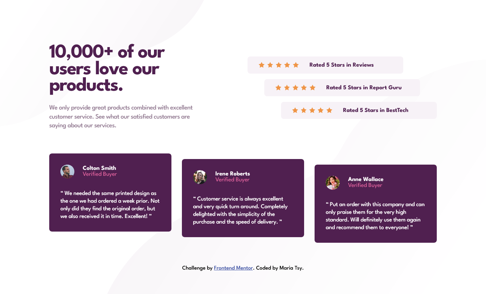
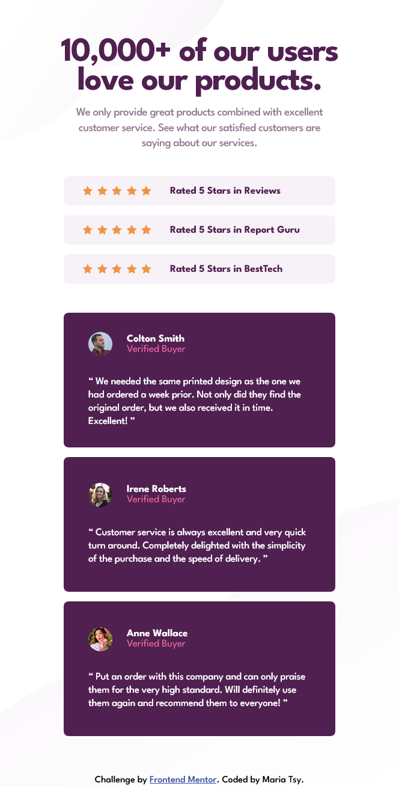

# Frontend Mentor - Social proof section solution

This is a solution to the [Social proof section challenge on Frontend Mentor](https://www.frontendmentor.io/challenges/social-proof-section-6e0qTv_bA). Frontend Mentor challenges help you improve your coding skills by building realistic projects.

# Screenshot

# Links

Solution URL: https://github.com/Ant105/Social-proof-section
Live Site URL: https://ant105.github.io/Social-proof-section/

# Built with

BEM, CSS Variables, Mobile-first approach, Flexbox, Semantic HTML5 markup
